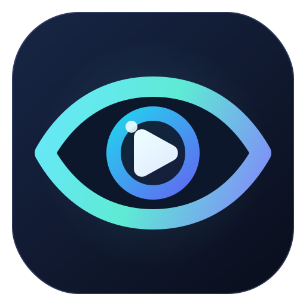
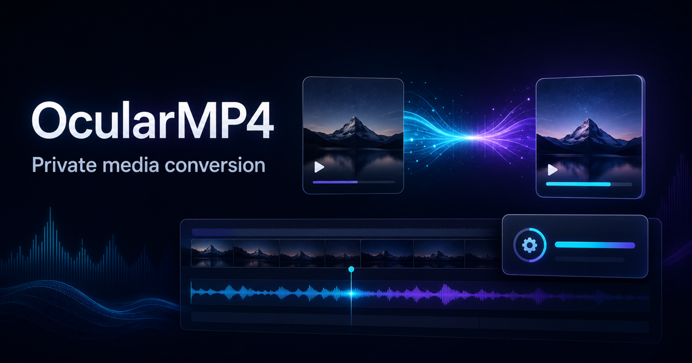

<p align="center">
  
</p>

<h1 align="center">OcularMP4</h1>

<p align="center">
  Private, local-first media conversion in the browser.
</p>

<p align="center">
  <a href="https://ocularmp4.netlify.app">Open OcularMP4</a>
  ·
  <a href="https://ocularmp4.netlify.app/guide">Read the guide</a>
</p>

[](https://ocularmp4.netlify.app)

OcularMP4 is an installable video and audio conversion studio built with
Next.js and FFmpeg.wasm. It imports media from the user's device, applies a
reusable encoding preset, converts the file locally in the browser, and returns
a downloadable result.

The app supports one-off conversions and an ordered batch queue. It also
includes a versioned preset workspace, local conversion history, optional
AI-generated FFmpeg presets, bilingual documentation, and offline-aware PWA
behavior.

## Highlights

- **Local media processing** — source files and converted outputs are not
  uploaded to the OcularMP4 server.
- **Two conversion engines** — use the lightweight native browser path for a
  quick WebM result or FFmpeg.wasm for exact formats and codecs.
- **Batch queue** — assign a preset and trim range to each file, reorder jobs,
  estimate output sizes, pause between jobs, retry failures, and download
  completed files individually.
- **Preset workspace** — search, filter, favorite, tag, rename, duplicate,
  delete, import, and export encoding presets.
- **Optional AI presets** — describe the desired output in plain language and
  receive a validated preset from one of ten configurable providers.
- **Local reliability features** — preflight checks, sanitized temporary file
  names, FFmpeg cleanup, conversion metadata history, interrupted-queue
  detection, and a warning before closing an active conversion.
- **Installable PWA** — app-shell caching, cached FFmpeg runtime files,
  installation controls, connection status, and controlled update prompts.
- **Bilingual interface** — English and Bahasa Indonesia, including the
  dedicated guide at `/guide`.
- **Accessible preferences** — system/light/dark themes and
  system/full/reduced motion settings.

## How it works

OcularMP4 follows a four-step workflow:

1. **Import** — choose or drop one or more local video or audio files. Select a
   file to preview it and set its trim range.
2. **Preset** — start with a built-in profile, reuse a saved preset, import
   preset JSON, or ask an AI provider to create one.
3. **Adjust** — review the format, video codec, resolution, frame rate, video
   bitrate, audio setting, and FFmpeg arguments.
4. **Export** — run the conversion, preview compatible results, and download
   the output.

Nine built-in presets cover common starting points:

| Preset | Intended result |
| --- | --- |
| Quick compatibility share | H.264/AAC MP4 at 720p |
| Small but HQ | Compact AV1/Opus WebM at 720p |
| Discord 25 MB | Discord-ready H.264/AAC MP4 with a 24 MB safety cap |
| HQ cinematic | High-quality HEVC/AAC MP4 at 1080p |
| Efficient AV1 encode | High-efficiency AV1/Opus WebM at 1080p |
| Efficient but less Compatibility | Quality-focused AV1/Opus WebM with slower encoding |
| Looping GIF | Palette-optimized 480p GIF |
| Clean audio extraction | MP3 audio extracted from video |
| Opus audio encode | Audio-only Opus WebM at 128 Kbps |

## Conversion engines

The two engines are intentionally different:

| | Native browser engine | FFmpeg.wasm |
| --- | --- | --- |
| Implementation | Canvas capture and `MediaRecorder` | FFmpeg running in WebAssembly |
| Output | VP9 WebM video | Output extension and FFmpeg arguments from the selected preset |
| Startup | Available immediately in compatible browsers | Loaded on demand from `unpkg.com` |
| Batch queue | Single-file conversion only | Processes queued files sequentially |
| Best use | Quick video-only WebM conversion | MP4, WebM, MKV, GIF, MP3, AAC, audio handling, and custom codec control |

> **Native-engine limitation:** the native path always records a WebM video
> stream from a canvas. It does not preserve audio and does not honor the
> selected container, codec, audio option, or custom FFmpeg arguments. Use
> FFmpeg.wasm whenever the requested preset output matters.

FFmpeg.wasm uses `@ffmpeg/core` 0.12.6. Its first load requires network access;
the service worker caches the runtime afterward when browser storage and cache
policies allow it. Conversion speed and practical file size depend on the
device's CPU, memory, browser, source codec, and selected settings.

The app blocks files larger than 2 GB during preflight. This guard is not a
guarantee that smaller files will fit in available browser memory.

## Batch queue and history

Selecting multiple files creates a queue. Each job keeps its own:

- source file and trim range;
- selected preset;
- estimated output size;
- position and status;
- completed download URL or failure message.

Batch conversion requires FFmpeg.wasm and runs one job at a time. Pausing takes
effect before the next queued job; it does not suspend FFmpeg in the middle of
the current encode. Cancelling terminates the active FFmpeg instance, so the
runtime must be loaded again before another FFmpeg conversion.

OcularMP4 stores a recovery snapshot of queue metadata. After a reload it can
report which jobs were interrupted, but browsers do not allow the app to
silently recover the original `File` objects—the user must select those files
again.

Conversion history keeps the 50 most recent completed, failed, or cancelled
jobs in local storage. It stores result metadata and the preset used, not the
source media or converted file. Download URLs exist only for the current
browser session.

Output-size estimates are calculated from the trim duration and configured
bitrates. They are planning estimates, not exact final sizes.

## Presets

A preset contains the settings shown in the interface plus an ordered list of
FFmpeg arguments. Supported preset values include:

- containers: MP4, WebM, GIF, MP3, AAC, and MKV;
- video codecs: H.264, VP9, HEVC, GIF, or no video;
- audio codecs: AAC, Opus, MP3, or no audio;
- resolutions: original, 1080p, 720p, 480p, and 360p;
- custom frame rate, video bitrate, audio bitrate, volume, tags, and favorite
  state.

Preset imports accept a single preset, an array, or the app's versioned export
envelope. Imports are validated and limited to 100 presets at a time. Exported
files contain non-built-in presets and never include provider credentials.

```json
{
  "schemaVersion": 2,
  "exportedAt": "2026-07-18T00:00:00.000Z",
  "presets": []
}
```

FFmpeg arguments are checked before conversion. OcularMP4 rejects extra input
arguments, network and file URLs, pipes, concat sources, script-based filters,
progress redirection, and argument lists longer than 100 entries.

## AI-generated presets

AI is optional. It generates preset metadata and FFmpeg arguments from a text
request; it never receives or inspects the imported media.

| Provider | Connection |
| --- | --- |
| OpenAI | Through the OcularMP4 API route |
| Google Gemini | Through the OcularMP4 API route |
| Groq | Through the OcularMP4 API route |
| Anthropic | Through the OcularMP4 API route |
| OpenRouter | Through the OcularMP4 API route |
| Together AI | Through the OcularMP4 API route |
| Mistral AI | Through the OcularMP4 API route |
| DeepSeek | Through the OcularMP4 API route |
| Ollama | Directly from the browser |
| Custom OpenAI-compatible endpoint | Directly from the browser |

The provider, model, endpoint, and credential are configured in **Settings**.
Cloud-provider requests send the prompt and temporary API key through the
app's server route for the current request. The repository has no server-side
credential store. Ollama and custom endpoints are contacted directly by the
browser and may require CORS configuration; Ollama users can allow the site's
origin with `OLLAMA_ORIGINS`.

Generated responses must match the app's preset schema before they can be
saved. The 30 most recent successful AI generations are stored locally and can
be restored without sending the prompt again.

## Privacy and browser storage

OcularMP4 has no accounts, database, or media-upload endpoint.

| Data | Storage |
| --- | --- |
| Imported media | Browser memory for the current session |
| Converted output | Browser memory as a temporary object URL |
| Settings and custom presets | `localStorage` |
| AI generation history | `localStorage`, up to 30 entries |
| Conversion metadata history | `localStorage`, up to 50 entries |
| Queue recovery metadata | `localStorage` |
| API keys | `sessionStorage` by default |
| Remembered API keys | `localStorage`, only when explicitly enabled |
| App shell and FFmpeg runtime | Browser Cache Storage |

Cloud AI still requires a network request to the selected provider. Clearing
the site's browser data removes saved settings, presets, histories,
credentials, recovery metadata, and offline caches.

## Offline and installation behavior

The PWA manifest allows OcularMP4 to run in a standalone window. The service
worker precaches the studio, guide, manifest, icons, and social image. Local
assets use stale-while-revalidate caching, while FFmpeg CDN files use a
cache-first strategy.

Offline behavior has boundaries:

- previously cached app routes and assets can open offline;
- the native engine can work without downloading FFmpeg;
- FFmpeg conversion works offline only after the runtime has loaded and cached
  successfully;
- cloud AI providers require a network connection;
- local Ollama can work without internet access when the browser can reach it.

When a new service worker is ready, the app presents an update action and waits
for user confirmation before activating it. Updating is disabled during an
active conversion.

## Local development

### Requirements

- Node.js 24
- npm 11
- a modern browser with WebAssembly and service-worker support;
- `MediaRecorder` and `HTMLCanvasElement.captureStream()` for the native engine.

### Start the development server

```bash
npm ci
npm run dev
```

Open [http://localhost:3000](http://localhost:3000).

OcularMP4 does not need server-owned AI secrets. Users enter provider
credentials in the app. The only documented environment value is the optional
public URL used when generating social metadata:

```bash
APP_URL="http://localhost:3000"
```

## Commands

| Command | Purpose |
| --- | --- |
| `npm run dev` | Start the Next.js development server |
| `npm run test` | Run conversion reliability and PWA tests |
| `npm run lint` | Run ESLint |
| `npm run typecheck` | Check TypeScript without emitting files |
| `npm run build:next` | Create the Next.js production build |
| `npm run build` | Build Next.js, create the OpenNext Cloudflare worker, and package the Sites artifact |
| `npm run validate` | Run lint, tests, typecheck, and the complete production build |
| `npm run version:check` | Check synchronized release-version references |
| `npm start` | Run the built Next.js server |

## Project structure

```text
app/
  page.tsx                   Main studio, queue, conversion engines, and PWA UI
  guide/page.tsx             Bilingual product guide
  api/ai/preset/route.ts     Cloud AI preset-generation proxy
  api/ai/test/route.ts       Cloud provider connection checks
components/
  settings-panel.tsx         General, AI, processing, and storage settings
lib/
  ai-providers.ts            Provider catalog, requests, and preset validation
  conversion-reliability.ts Queue recovery, preflight, estimates, and filenames
  preset-workspace.ts        Preset and history persistence
  settings.ts                Versioned preferences and credential storage
  i18n.ts                    English and Bahasa Indonesia interface strings
public/
  manifest.json              PWA metadata
  sw.js                      Offline cache and update lifecycle
tests/
  conversion-reliability.test.ts
  pwa.test.ts
```

## Deployment and releases

The official public deployment is
[ocularmp4.netlify.app](https://ocularmp4.netlify.app).

The repository also contains an OpenNext Cloudflare configuration.
`npm run build` produces:

- `.next/` — Next.js production output;
- `.open-next/` — the Cloudflare worker and static assets;
- `dist/` — the packaged Sites artifact.

Cross-origin opener and embedder headers are configured for WebAssembly
compatibility.

OcularMP4 follows Semantic Versioning. The current version is `1.0.0`. Release
versions must remain synchronized between `package.json`, the settings panel,
the service worker, and PWA checks.

Before releasing:

```bash
npm run version:check
npm run validate
```
